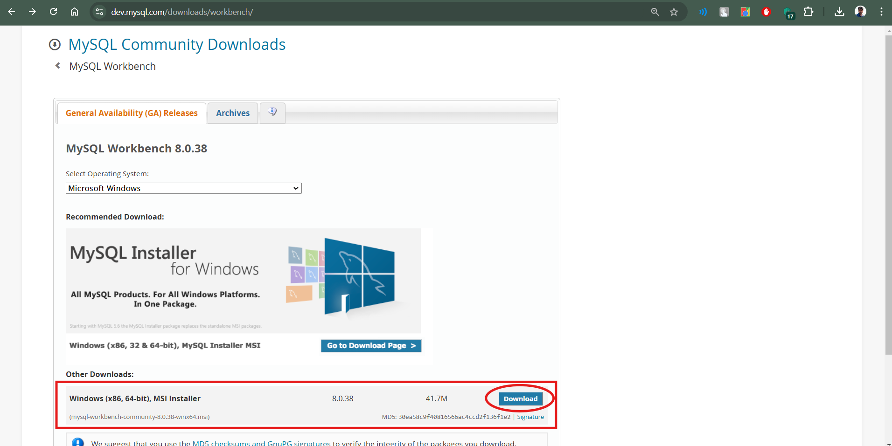
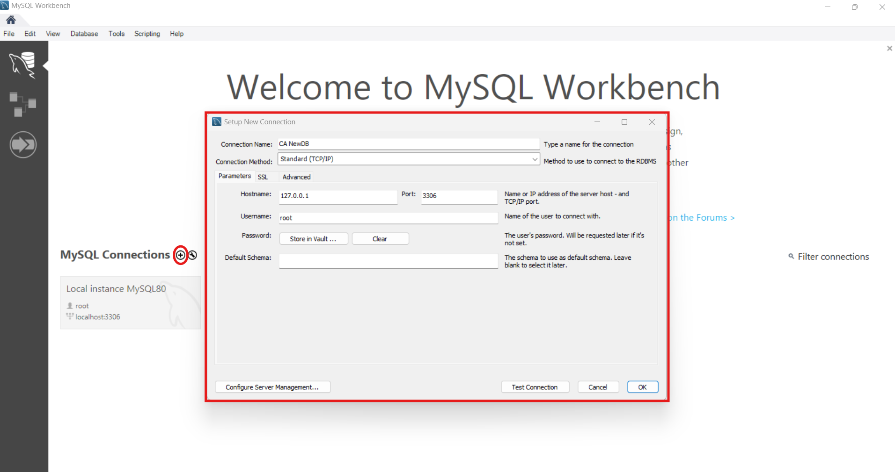

<h1>CLOUD AMBASSADORS - DATA ENGINEER - TAKE HOME ASSESSMENT</h1>


## **Task 2: SQL Data Analysis on a Local Database**

### Table of Contents
- [Task Objective](#task-objective)
- [Project Overview](#project-overview)
- [Installation and Setup](#installation-and-setup)
  - [download MySQL Workbench](#download-mysql-workbench)
  - [Download Dataset from Kaggle](#download-dataset-from-kaggle)
- [Import Dataset to MySQL Schema](#import-dataset-to-mysql-schema)
- [Perform Data Analysis on the uploaded dataset](#perform-data-analysis-on-the-uploaded-dataset)
  - [SQL Queries](#sql-queries)
  - [Query 1: Select all data from the table](#query-1-select-all-data-from-the-table)
  - [Query 2: Count the total number of records in the dataset](#query-2-count-the-total-number-of-records-in-the-dataset)
  - [Query 3: Find the total sales per Gender](#query-3-find-the-total-sales-per-gender)
  - [Query 4: Find the average rating of all sales](#query-4-find-the-average-rating-of-all-sales)
  - [Query 5: Count of Payment types in each branch](#query-5-count-of-payment-types-in-each-branch)
  - [Query 6: Find distinct products with a unit price more than 45](#query-6-find-distinct-products-with-a-unit-price-more-than-45)
  - [Exporting the Data to a CSV file](#exporting-the-data-to-a-csv-file)
- [Author](#author)
- [References](#references)


### **Task Objective:** Perform basic data analysis using SQL on any local or cloud-based relational database.<br>

- **Dataset**: Choose any publicly available dataset from Kaggle or any other data sources from the internet. Import this dataset into a relational database (e.g.,
SQLite, MySQL, PostgreSQL).
- **SQL Queries**: Write and execute the following SQL queries on the dataset:
  - Count the total number of records in the dataset. 
  - Find the sum or average of a numerical column (e.g., sales, prices, scores). 
  - Filter the dataset based on a condition (e.g., find all records where a column meets a specific threshold or value).
- **Document the Queries**: Provide the SQL queries, along with their results, in your GitHub repository.

---

### **Project Overview**
- **Operating System:** Windows
- **Tools Used:** SQL, MySQL Workbench
- **Dataset:** [Kaggle - Supermarket sales](https://www.kaggle.com/datasets/aungpyaeap/supermarket-sales)
- **Files:** `supermarket_sales - Sheet1.csv`: Source dataset from Kaggle.

---

### Installation and Setup of MySQL Workbench

#### **1 - Download MySQL Workbench**
- **Step 1:** Download MySQL Workbench from the official website. [here](https://dev.mysql.com/downloads/workbench/)
 
- **Step 2:** Install the downloaded file by following the installation instructions.
- **Step 3:** Open MySQL Workbench and create a new connection.
 
- **Step 4:** Connect to the server via root.
 
- **Step 5:** Create a new schema/DB.
 
- **Step 6:** Connect to the schema/DB.
 
- **Step 7:** Create a table.
 

```sql
CREATE TABLE `new_sales_data` (
  `Invoice ID` text,
  `Branch` text,
  `City` text,
  `Customer type` text,
  `Gender` text,
  `Product line` text,
  `Unit price` double DEFAULT NULL,
  `Quantity` int DEFAULT NULL,
  `Tax 5%` double DEFAULT NULL,
  `Total` double DEFAULT NULL,
  `Date` text,
  `Time` text,
  `Payment` text,
  `cogs` double DEFAULT NULL,
  `gross margin percentage` double DEFAULT NULL,
  `gross income` double DEFAULT NULL,
  `Rating` double DEFAULT NULL
);
```
#### **2 - Download Dataset from Kaggle**
- Navigate to the Kaggle dataset page [this](https://www.kaggle.com/datasets/aungpyaeap/supermarket-sales) and download the dataset.
- Click on the `Download` button to download the dataset.
- Extract the downloaded file to get the `.csv` file.


---
### **Import Dataset to MySQL Schema**
- Click on the `Table Data Import Wizard` option.
 
- Select the `.csv` file and configure the import settings.
 
- Click on the `Start Import` button to import the dataset.
- Verify that the dataset has been imported successfully.


---
### **Perform Data Analysis on the uploaded dataset**

#### **SQL Queries**
- **Query 1:** Select all data from the table.
  ```sql
    SELECT * FROM new_sales_data;
  ```
  *OUTPUT*:
  

- **Query 2:** Count the total number of records in the dataset.
    ```sql
        SELECT COUNT(*) FROM new_sales_data;
    ```
    *OUTPUT*:
    

- **Query 3:** Find the total sales per Gender.
  ```sql
  SELECT Gender, ROUND(SUM(total),2) as total_sales
  FROM luccidx_newdb.new_sales_data 
  GROUP BY Gender;
  ```
    *OUTPUT*:
    

- **Query 4:** Find the average rating of all sales.
  ```sql
  SELECT ROUND(AVG(Rating),2) as avg_rating
  FROM luccidx_newdb.new_sales_data;
  ```
    *OUTPUT*:
    

- **Query 5:** Count of Payment types in each branch.
  ```sql
  SELECT Branch, Payment, COUNT(Payment) as Types_of_payment_in_each_branch
  FROM luccidx_newdb.new_sales_data
  GROUP BY Branch, Payment
  ORDER BY Branch;
  ```
    *OUTPUT*:
    

- **Query 6:** Find distinct products with a unit price more than 45.
- ```sql
  SELECT DISTINCT `Product line`
  FROM new_sales_datanew_sales_datanew_sales_data
  WHERE `Unit price` > 45.0 
  ORDER BY `Product line` ASC;
  ```
    *OUTPUT*:
    

---
### **Exporting the Data to a CSV file**
- all the above queries result are exported and saved in .csv format in the `Export` folder.
- The exported files are:
  - `Q1all_data_script.csv`
  - `Q2Count_of_Records.csv`
  - `Q3Total_Sales_per_gender.csv`
  - `Q4Average_Rating_of_all_Sales.csv`
  - `Q5Count_of_Payment_types_in_each_branch.csv`
  - `Q6Products_unitprice_more_than45.csv`
---

### **Author**
- **G Santosh Kumar**
- **Email:** `girisantoshkumar1999@gmail.com`
- **GitHub:** [luccidx](https://github.com/luccidx)

- **Socials:**
[](https://linkedin.com/in/g-santosh-kumar) 
[](https://facebook.com/santosh.roxstar34) 
[](https://instagram.com/https://instagram.com/luccidx)
[](https://medium.com/@girisantoshkumar1999) 
[](https://x.com/g_santoshkumar1) 
[](https://youtube.com/@girisantoshkumar) 

---
### **References**
- [MySQL Workbench Download](https://dev.mysql.com/downloads/workbench/)
- [Kaggle - Supermarket sales](https://www.kaggle.com/datasets/aungpyaeap/supermarket-sales)
- [MySQL Workbench Documentation](https://dev.mysql.com/doc/workbench/en/)